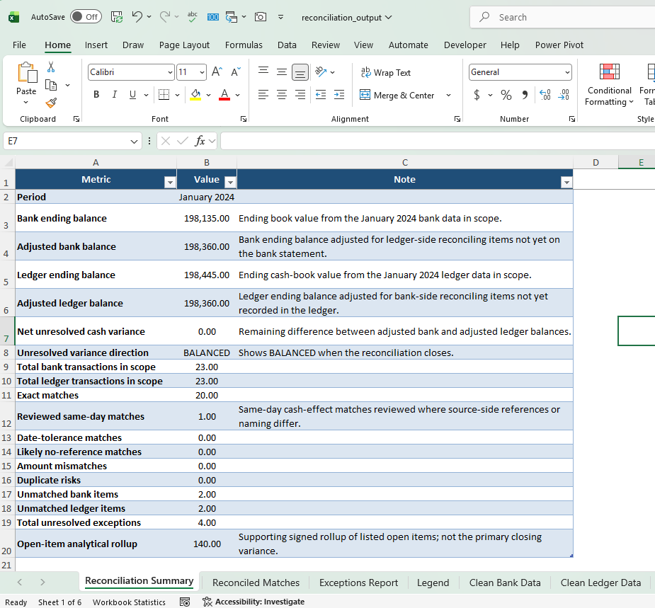
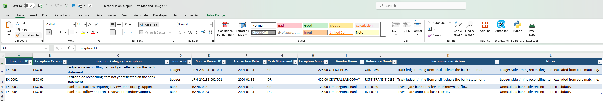
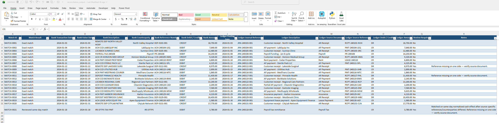

# Automated Bank-to-Ledger Reconciliation

A portfolio-quality finance operations project that automates a month-end bank-to-ledger reconciliation workflow using Python.

This project is built to reflect how a finance or accounting analyst would approach a controlled reconciliation process: start from raw source data, standardize the inputs, apply defined matching logic, isolate exceptions, and produce review-ready outputs.

## What This Project Does

The workflow ingests three raw CSV files — bank transactions, ledger transactions, and payment obligations — and runs them through a structured reconciliation pipeline that:

- cleans and standardizes source data before matching begins
- reconciles bank and ledger transactions using a six-step priority rule sequence (Rules 1, 1B, 2, 3, 4, and 4B)
- separates confirmed matches from items requiring review
- classifies unresolved items into seven active exception categories
- produces an adjusted bank balance, adjusted ledger balance, and net variance proof
- outputs a formatted Excel workbook with six review-ready tabs

## Version 1 Scope

This repository is intentionally limited to a controlled Version 1 scope:

- one month
- one entity
- one currency
- no prior-period carry-forward
- no opening balance bridge

The primary reconciliation is **Bank transactions vs Ledger transactions**. The payment obligations file is included as a supporting reference layer for cash-flow context, but it is **not** the core matching engine in Version 1.

## Workflow

The project follows this finance-oriented workflow:

**raw CSV → clean / standardize → reconcile → classify exceptions / variance → review / next steps**

This keeps the process aligned with realistic finance operations work and preserves the raw CSV files as the official source foundation.

## Official Source Inputs

The project begins from these raw input files:

- `data_raw/bank_transactions_sample.csv`
- `data_raw/ledger_transactions_sample.csv`
- `data_raw/payment_obligations_sample.csv`

These raw files are the official starting point. Any cleaned, prepared, or intermediate files are workflow outputs, not source foundations.

## How to Run

Python 3.x required.
```bash
pip install pandas openpyxl
python src/main.py
```

## Outputs

Running the script produces the following in `output/`:

| File | Contents |
|---|---|
| `reconciliation_output.xlsx` | Full Excel workbook with summary, matches, exceptions, legend, and cleaned source tabs |
| `reconciled_matches.csv` | Matched bank-ledger pairs with match result labels and review flags |
| `exceptions_report.csv` | Review report covering unmatched items, duplicate risks, timing items, and matched exceptions requiring follow-up |
| `reconciliation_summary.csv` | Adjusted balances, net variance, and transaction counts |
| `clean_bank_data.csv` | Final review-ready cleaned bank transactions |
| `clean_ledger_data.csv` | Final review-ready cleaned ledger transactions |
| `legend.csv` | Reference table for selected match labels and key exception categories used in the workbook |

## Project Structure
```text
project-root/
├── README.md
├── AGENTS.md
├── data_raw/                                         ← official source inputs, never modified
│   ├── bank_transactions_sample.csv
│   ├── ledger_transactions_sample.csv
│   └── payment_obligations_sample.csv
├── data_clean/                                       ← intermediate cleaned files produced by cleaning.py
│   ├── bank_transactions_cleaned.csv
│   ├── ledger_transactions_cleaned.csv
│   └── payment_obligations_cleaned.csv
├── output/                                           ← all final reconciliation outputs
│   ├── reconciliation_output.xlsx
│   ├── reconciled_matches.csv
│   ├── exceptions_report.csv
│   ├── reconciliation_summary.csv
│   ├── clean_bank_data.csv
│   ├── clean_ledger_data.csv
│   └── legend.csv
├── screenshots/
│   ├── Reconciliation_Summary.png
│   ├── Exceptions_Report.png
│   └── Reconciled_Matches.png
├── src/
│   ├── main.py
│   ├── ingestion.py
│   ├── cleaning.py
│   ├── reconciliation.py
│   └── config.py
└── docs/
    ├── Finance_Reconciliation_V1_Final_Logic.docx
    ├── Finance_Reconciliation_V1_Aligned_Raw_Data.docx
    └── Finance_Reconciliation_V1_Raw_Source.docx
```

**Note on cleaned file locations:** `data_clean/` holds intermediate cleaned CSVs produced during the standardization stage — these are pipeline working files. `output/clean_bank_data.csv` and `output/clean_ledger_data.csv` are the final review-ready versions written alongside the other reconciliation outputs. They serve different purposes in the workflow.

## Reconciliation Logic

Before matching begins, each source file is independently scanned for possible duplicates. Flagged rows are excluded from the matching pool and routed directly to the exceptions report as EXC-06. Matching then runs on the remaining clean pool using the following priority sequence:

| Rule | Match Type | Criteria | Review Required |
|---|---|---|---|
| 1 | Exact Match | Reference or counterparty + amount + same date | No, unless reference missing on one side |
| 1B | Reviewed Same-Day Match | Same-day cash effect match where reference or counterparty differs | Yes |
| 2 | Date Tolerance | Reference or counterparty + amount + 1–5 day gap | No, unless reference missing on one side |
| 3 | No Reference | Amount + counterparty match + date within 5 days, reference missing | Yes |
| 4 | Amount Mismatch | Reference or counterparty match, amount variance within $250 tolerance | Yes |
| 4B | Amount Mismatch Over Tolerance | Reference match, amount variance exceeds $250 | Yes |

Once a pair is matched at any rule, both records leave the pool. Lower-priority rules only evaluate unmatched rows.

Unresolved items are classified into seven active exception categories: EXC-01 (bank item not in ledger), EXC-02 (ledger item not in bank), EXC-03 (amount mismatch), EXC-04 (missing reference), EXC-06 (duplicate risk), EXC-07 (unknown bank outflow), and EXC-08 (unposted bank receipt). Date-gap matches are carried with a `DATE_GAP` info flag on matched rows rather than emitted as a standalone exception.

Full logic specification is in `docs/Finance_Reconciliation_V1_Final_Logic.docx`.

## Output Preview

**Reconciliation Summary** — adjusted balances and closing proof:



**Exceptions Report** — exception categories and cash direction:



**Reconciled Matches** — matched pairs with review flags:



## Skills Demonstrated

- Python-based financial data pipeline (ingestion, cleaning, matching, exception classification)
- Accounting and finance workflow design (bank reconciliation, D/C conventions, reconciling items)
- Structured exception reporting with cash direction standardization
- Excel workbook generation with `openpyxl`
- Spec-driven development with documented logic and validation test cases